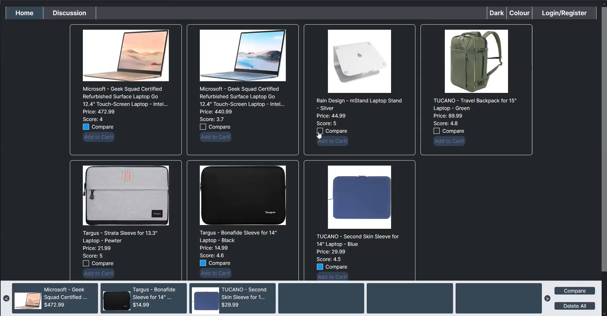
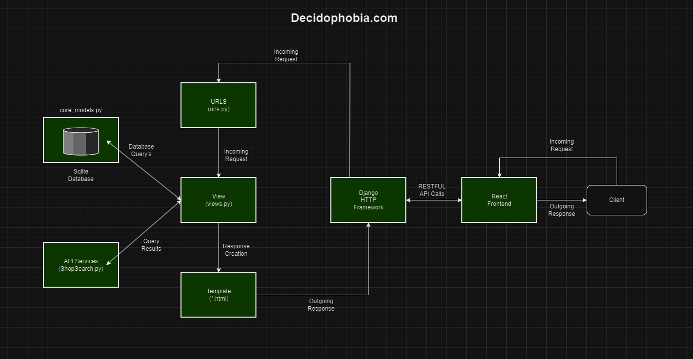
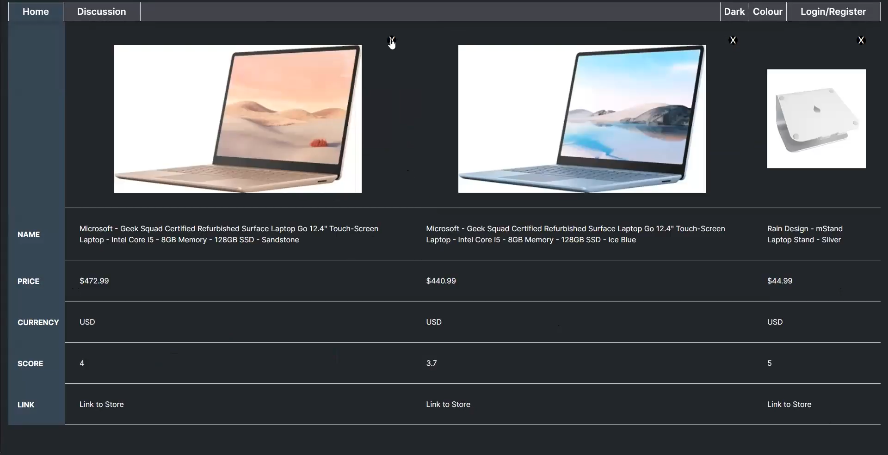
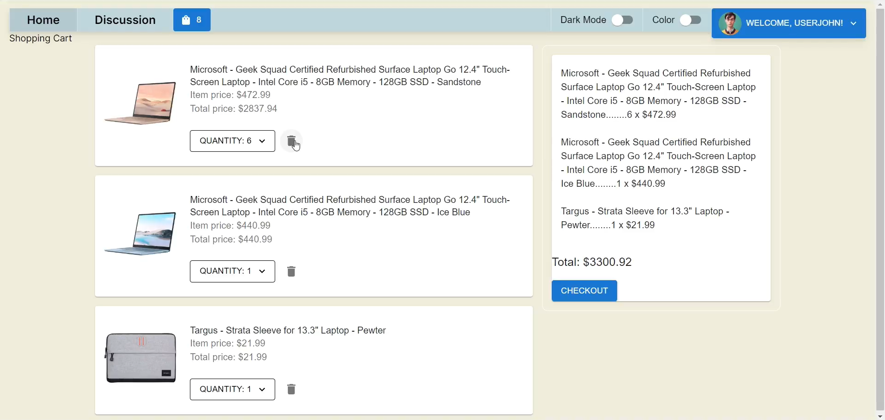
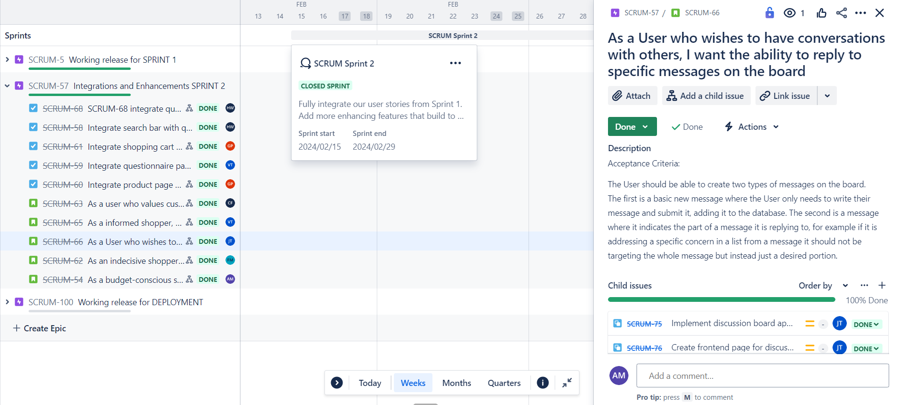
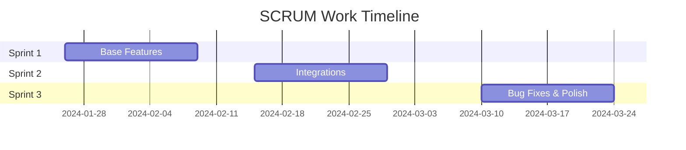

**Decidophobia**: An eCommerce Site for Indecisive Shoppers 
===


## Table of Contents

<!-- TOC start (generated with https://github.com/derlin/bitdowntoc) -->

- [Another eCommerce Site... What's Special?!](#another-ecommerce-site-whats-special)
- [In a Nutshell](#in-a-nutshell)
- [General Architecture](#general-architecture)
- [Technical](#technical)
   * [Technical Summary](#technical-summary)
   * [~ Questionnaire](#-questionnaire)
   * [~ HTTP Client](#-http-client)
   * [~ Comparing Products](#-comparing-products)
   * [~ Order Management](#-order-management)
   * [~ User Accounts](#-user-accounts)
   * [~ Discussion Board](#-discussion-board)
- [Main User Stories](#main-user-stories)
- [Project Management](#project-management)
- [Authors](#authors)

<!-- TOC end -->

<!-- TOC --><a name="another-ecommerce-site-whats-special"></a>
## Another eCommerce Site... What's Special?!
Yes, we agree: there are too many eCommerce sites to begin with. But that's exactly why we *decided* to just add 1 more to the list...

Decidophobia is a student-led project designed to solve a very specific problem: the dilemma of choice. Here's a list you can contemplate about:
* Amazon
* eBay
* Walmart
* Craigslist
* Etsy
* Kijiji (🍁)
* Facebook Marketplace
* Instagram
* BestBuy
* Your dog
* My Neighbor
* ...

Clearly, the number of eCommerce sites don't seem to end. With so many choices to pick from, a lot of us humans are tempted to start comparing them all. Why? Because we want to buy something knowing we got the best deal ever! And that's fine... because I do it too. 

With this context in mind, we present a solution to the flurry of open tabs and the constant back-and-forth in between: one website that can just give me the best deal, every single time. 

<!-- TOC --><a name="in-a-nutshell"></a>
## In a Nutshell


Decidophobia is mainly an eCommerce aggregator and a product rating system. We use availabe eCommerce API's to request, aggregate and display produts from different websites. Put in other words, we talk to online shopping sites and ask them for a list of their products. Then, we rank those products based on a variety of common-sense metrics like your individual preferences, price and product reviews. 


<!-- TOC --><a name="general-architecture"></a>
## General Architecture



Add text here...
> Read more about sequence-diagrams here: http://bramp.github.io/js-sequence-diagrams/

<!-- TOC --><a name="technical"></a>
## Technical
<!-- TOC --><a name="technical-summary"></a>
### Technical Summary
Decidophobia currently sits as a web-app with a Django backend and a React (Next.js) frontend. It also uses Docker to ensure universal runnability, and Postgres as its DBMS.

<!-- TOC --><a name="-questionnaire"></a>
### ~ Questionnaire
React was used to construct a questionnaire that collected user preferences. This included selections about how imporant product ratings, brand reputation and quick delivery time were to the user. 

<!-- TOC --><a name="-http-client"></a>
### ~ HTTP Client
To request product information, an HTTP client was architected using the decorator pattern. The client requests and retrieves information (JSON) using OAuth 2.0 protocols while minting authentication tokens automatically. 

<!-- TOC --><a name="-comparing-products"></a>
### ~ Comparing Products
The product comparison feature uses the JSON returned by the HTTP client to index each product accordingly. By using React, the search result page is created by placing each indexed product into a series of tables. Then, when a user clicks "Compare", the indices of these products is moved onto an array which maps onto the side-by-side product bar at the bottom of the screen. 



<!-- TOC --><a name="-order-management"></a>
### ~ Order Management
React was used to design the shopping cart and order history pages. React components from the Material UI components library were utilized to create the frontend pages. For the cart functionality (adding/removing/updating items), axios was used to send requests to the backend.

Each shopping cart item and purchase-history entry is stored with foreign keys to the products and users tables. Moreover, a randomly generated, unique, 10-character alphanumeric ID was used to identify each specific order.



<!-- TOC --><a name="-user-accounts"></a>
### ~ User Accounts
React was used to design the user settings page. It interacts with the Django backend, which uses different serializers to change the various components of a user account, i.e. email and password. User accounts are facilitated using a *CustomUser* model that is a subclass of Django's *AbstractBaseUser*.

<!-- TOC --><a name="-discussion-board"></a>
### ~ Discussion Board
React was used to create the discussion board, while user messages were stored in a Django backend. Axios requests are used to interact with the Django backend, primarily to retrieve and insert messages to display onto the discussion board.

<!-- TOC --><a name="main-user-stories"></a>
## Main User Stories

> “There’s always more to build than we have time or resources to build — always.” [name=Jeff Patton]
<details> 
    <summary><strong>Questionnaire</strong></summary>
    
```gherkin=
Feature: Questionairre
  As an frequent shopper, I want to quickly select
  all my individual preferences like budget, favorite
  sites, and delivery time.
  
  Scenario: User arrives at the home page
    Given I clicked on "SearchFilter",
    Then I can toggle my unique preferences
    And get results that are curated appropriately.
```
</details>

<details>
    <summary><strong>eCommerce HTTP Client </strong></summary>
    
```gherkin=
Feature: eCommerce HTTP Client
  As an indecisive shopper, I want to see results 
  from all the eCommerce sites I request for. 
  
  Scenario: User types item name into the search bar
    Given I selected my preferred shopping sites,
    When I click "search"
    Then I will get a list of curated products.
```
</details>

<details>
    <summary><b>Interactive Comparison</b></summary>
    
```gherkin=
Feature: Interactive Comparison
  As a shopper on a budget, I want to interactively
  compare the main features of different products. 
  
  Scenario: User is directed to the search results
    Given I found a suitable product,
    When I click "Compare"
    Then I can compare products side-by-side.
```
</details>
<details>
<summary><b>Shopping Cart</b></summary>

```gherkin=
Feature: Shopping Cart
  As a casual shopper, I want to put items in my shopping cart
  because I want to manage items before I checkout.

  Scenario: User adds item to cart
    Given I'm a logged-in user
    When I go to the item page
    And I click "Add item to cart"
    Then the quantity of items in my cart should go up
    And my subtotal should increment accordingly.
```
</details>

<details>
    <summary><b>User Accounts</b></summary>
    
```gherkin=
Feature: User Accounts
  As an avid shopper, I want to be able to be able to change my
  user account information. 

  Scenario: I want to update my account information
    Given I am logged in
    When I navigate to the settings page
    And I click on the button to change my password, email, etc.
    Then the database will be updated with the new information
    And the changes will be reflected in the GUI
```
</details>

<details>
    <summary><b>Community Discussion Board</b></summary>
    
```gherkin=
Feature: Discussion Board
  As a shopper with FOMO, I want a place to interact with other 
    shoppers where I can discuss the best deals and sales in 
    the website.

  Scenario: I want to look for the hottest new deals
    Given I am logged in,
    When I navigate to the discussion board
    Then I find discussions about different, linked products.
```
</details>
> Read more about Gherkin here: https://docs.cucumber.io/gherkin/reference/


<!-- TOC --><a name="project-management"></a>
## Project Management


Throughout every sprint, Jira was used to manage our prouduct backlog. Our development was mainly split into 3 sprints, along with initial sprint pre-planning sessions. 

Each sprint culminated with a product demo, where either the main features or the newest additions were presented. After our last sprint, we decided to complete a video presentation discussing what our product is, and what its market would look like. 
This video can be watched <a href="https://youtu.be/VAtVXeAbKok">here.</a>

In terms of our work timeline, as followers of the SCRUM methodology, our iterative work process is roughly graphed below:


<!-- TOC --><a name="authors"></a>
## Authors

:::info
**Decidophobia is a public project** lead by a team of 7 individuals. 

The members of this team are (listed alphabetically):
- [Ahmed Mohamed](https://github.com/ahmed33033)
- [Chris Flores](https://github.com/cfstar188)
- [Faisal Masalha](https://github.com/TrueDescription)
- [Gaurav Poona](https://github.com/gaurav3247)
- [Hung-Mao Wu](https://github.com/wuhungmao)
- [Justin Tran](https://github.com/JustAProjectacc)
- [Vincent Tran](https://github.com/MintV-Vincent)


<!-- TOC --><a name="tags-decidophobia-ecommerce-documentation"></a>
###### tags: `Decidophobia` `eCommerce` `Documentation`
